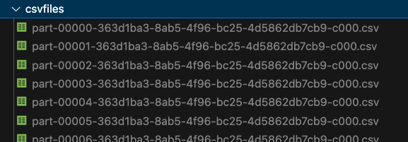

# On the feasibility of IoT attack detection using Machine Learning and Generative AI 

This project aimed to investigate how well models trained on synthetic data performed when classifying real IoT attack data. Before running any of the notebooks, you first need to get the data.

Make sure all the csv files are in /csvfiles for the loading and training to work. The CSV Files are located here: https://www.unb.ca/cic/datasets/iotdataset-2023.html. After you download the ZIP file, make sure to place the CSVS in /csvfiles. 

Your directory should then look something like 

Each directory in this project serves a different purpose and we made it as modular as possible (and each section has it's own README as well). A high level overview of each directory is below:

- [data_breakdown](/data_breakdown/) contains two notebooks used to describe the features and label in our dataset. 
- [generator_custom](/generator_custom/) contains a notebook used to train our CTGAN synthetic model. It trains, and saves the model and also has an example on how to load it. To load the CTGAN model you need to download it from here: https://drive.google.com/file/d/18093QX17Io-i9c6IOI7lgnaXF-aasJel/view?usp=drive_link since it was too large to upload to Github. There are also python files you can run instead of a notebook, each with a different set of size parameters depending on how much real data you wanted to sample.  
- [hpc_batch_scripts](/hpc_batch_scripts/) has all of the scripts used to run the models on the High Performance Computing Cluster. More info can be found here: https://hpc.ncsu.edu/Hazel/  
- [neuralnetwork](/neuralnetwork/) contains notebooks and python files pertaining to the training of our neural network. We have a simple neural architecture, and a complex one that you can run and train. There are also two trained models there (one on synthetic data and one on real data) that accurately classify the 7 class problem.
- [regression](/regression/) contains notebooks to train a logistic regression classifier on the dataset.
- [synthetic_data](/synthetic_data/) contains a notebook and python files related to training a Gaussian Copula model for generating synthetic data along with the synthesizer in [/synthetic_data/synthesizer_pickles/](/synthetic_data/synthesizer_pickles/)
- [util](/util/) has utilities that each of the models use to load, and scale our data. It handles the 2/7/34 class transformation and takes an argument to serve different sample sizes. The notebooks and python files throughout our repo show different usage examples. 
- [yaml](/yaml/) has the necessary dependencies in yaml format for the HPC cluster (and can be used locally if using anaconda). 
  
